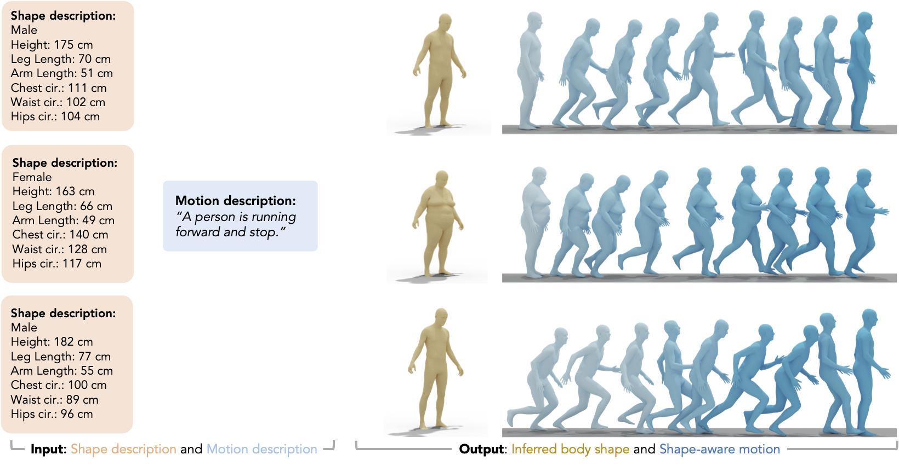

<p align="center">
  <h1 align="center">Shape My Moves: Text-Driven Shape-Aware Synthesis of Human Motions </h1>

  <div align="center">

🚩 Accepted at [CVPR 2025](https://cvpr.thecvf.com/)

<a href='https://arxiv.org/abs/2504.03639'></a>
[](https://shape-move.github.io)

[Ting-Hsuan Liao](https://tinghliao.github.io/)<sup>1,2</sup>
[Yi Zhou](https://zhouyisjtu.github.io/)<sup>2</sup>
[Yu Shen](https://research.adobe.com/person/yu-shen/)<sup>2</sup>
[Chun-Hao Paul Huang](https://research.adobe.com/person/paulchhuang/)<sup>2</sup>
[Saayan Mitra](https://research.adobe.com/person/saayan-mitra/)<sup>2</sup>
[Jia-Bin Huang](https://jbhuang0604.github.io/)<sup>1</sup>
[Uttaran Bhattacharya](https://uttaranb127.github.io)<sup>2</sup>

<sup>1</sup>University of Maryland, College Park, USA, <sup>2</sup>Adobe Research
</div>

  <div align="center">
    
  </div>
  
</p> 

This is the implementation of ShapeMove, a framework for generating body-shape-aware human motion from text. ShapeMove combines a quantized VAE with continuous shape conditioning and a pretrained language model to synthesize realistic, shape-aligned motions from natural language descriptions.

## ⚙️ Environment Setup

```
conda create -n shapemove python=3.10
conda activate shapemove
pip install torch==2.4.1 torchvision==0.19.1 torchaudio==2.4.1 --index-url https://download.pytorch.org/whl/cu118
pip install -r requirements.txt
```

## ⌛️ Download Data and Base Models

```
bash scripts/download_models.sh
```
This step will download our pretrained ShapeMove model trained with the [AMASS dataset](https://amass.is.tue.mpg.de/index.html), the [flan-t5-base](https://huggingface.co/google/flan-t5-base) language model, and the [SMPL](https://smpl.is.tue.mpg.de/) neutral model for visualization.


## 📐 Inference Model

```
bash scripts/demo.sh
```
The output motion and shape beta will be saved under `outputs`.

## 🎞️ Render Motion

### Blender setup
Follow the setup steps in [TEMOS](https://github.com/Mathux/TEMOS/tree/master?tab=readme-ov-file#rendering-motions-high_brightness).

After installing blender and required packages in the python environment of blender, run the following command to ensure installation:
```
blender --background --version
```
This should return Blender 2.93.18.

### Render Meshes with Blender
```
# generate mesh with given beta and motion .npy file
python -m utils.mesh --dir [path/to/inference/output/folder]

# generate image from blender (with obj/ply file)
blender --background -noaudio --python utils/blender_render.py -- --mode=video --dir [path/to/mesh/folder]

# gather generated image and make video
python utils/visualization.py --dir [path/to/mesh/folder]
```


## Citations
### Shape My Moves (this work)
```bibtex
@article{shapemove,
    author    = {Liao, Ting-Hsuan and Zhou, Yi and Shen, Yu and Huang, Chun-Hao Paul and Mitra, Saayan and Huang, Jia-Bin and Bhattacharya, Uttaran},
    title     = {Shape My Moves: Text-Driven Shape-Aware Synthesis of Human Motions},
    journal   = {Proceedings of the IEEE/CVF Conference on Computer Vision and Pattern Recognition (CVPR)},
    month     = {June},
    year      = {2025}
}
```
### SMPL
Please follow the [official instructions](https://smpl.is.tue.mpg.de/index.html) to cite SMPL.
### AMASS
Please follow the [official instructions](https://amass.is.tue.mpg.de/index.html) to cite AMASS.

## Licenses
### Shape My Moves (this work)
[MIT License](https://github.com/shape-move/shape-move-public/blob/main/LICENSE)
### SMPL
Please follow the [official licensing terms for SMPL](https://smpl.is.tue.mpg.de/modellicense.html).
### AMASS
Please follow the [official licensing terms for AMASS](https://amass.is.tue.mpg.de/license.html).

## Acknowledgments 
Some great resources we benefit from: [MotionGPT](https://github.com/OpenMotionLab/MotionGPT/), [T2M-GPT](https://github.com/Mael-zys/T2M-GPT) and [text-to-motion](https://github.com/EricGuo5513/text-to-motion).
